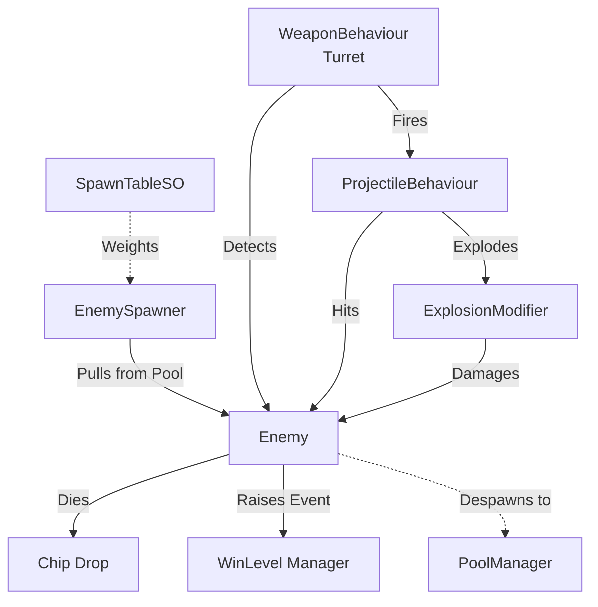
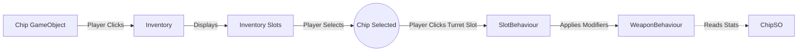

# Project Manatite Architecture Documentation

This document outlines the current software architecture of **Project Manatite**. The codebase has been thoughtfully structured to use loose coupling, data-driven design via ScriptableObjects, event-driven communication, and performance-friendly utilities like Object Pooling and cached queries.

## 1. High-Level Architecture Overview

The project is broken down into several modular subsystems:
- **Core Systems**: Event buses, interfaces, centralized configuration, and object pooling.
- **Battle System**: Entity behaviors (Enemies, Player), Projectiles, Weapons (Turrets), and the Chip upgrade system.
- **UI & Flow**: HUDs, Menu transitions, World Map selection, and end-of-battle states.
- **Background & Visuals**: Procedural animation, parallax scrolling, and ambient effects.

---

## 2. Core Patterns & Principles

### Decoupling via Interfaces
Instead of components referencing specific classes (e.g., `Projectile` knowing about `Enemy`), systems interact via interfaces:
- `IDamageable`: Implemented by `Enemy` and `Player`. Anything that deals damage (projectiles, explosions) simply looks for this interface.
- `IEquippable`: Implemented by `WeaponBehaviour`. Allows chips and modifiers to be applied without knowing the concrete turret class.
- `IPoolable`: Used by `PoolManager` to reset an object's state when it's spawned or despawned.

### Event-Driven Communication
To prevent tightly coupled "spaghetti code" (where enemies talk directly to the UI, for example), the game uses an Event Bus (`GameEvents.cs`).
- **Producers** raise events: An `Enemy` dies and raises `GameEvents.EnemyDied()`. A `Chip` is picked up and raises `GameEvents.SaveRequested()`.
- **Consumers** listen: The `WinLevel` script listens to `EnemyDied` to update the progress bar. The `Coins` UI listens to `CoinsChanged` to update the HUD.

### Performance Optimizations
- **Object Pooling**: Managed by `PoolManager`. Projectiles and Enemies are pooled instead of repeatedly `Instantiate`'d or `Destroy`'d.
- **Query Buffers**: `Physics2DBuffers.cs` uses non-allocating Physics2D overlaps (e.g., `OverlapCircleNonAlloc`) to prevent garbage collection spikes.
- **Caching**: 
  - `CameraCache` prevents the expensive `Camera.main` lookup from being called every frame.
  - `WaitCache` reuses `WaitForSeconds` instances to avoid allocations inside Coroutines.

---

## 3. System Interactions

### The Battle Loop

1. **Spawning**: `EnemySpawner` reads from a `SpawnTableSO` to figure out what to spawn and asks the `PoolManager` for an instance.
2. **Combat**: A turret (`WeaponBehaviour`) checks for enemies using `Physics2DBuffers`. When an enemy is in range, it fires a pooled `ProjectileBehaviour`.
3. **Damage**: The projectile (or its `ExplosionModifier`) detects `IDamageable` on the enemy and applies damage.
4. **Death**: When the enemy's HP reaches 0, it drops loot (configured in `EnemySO`), raises `GameEvents.EnemyDied`, and returns itself to the `PoolManager`.

### The Chip & Inventory System

1. **Collection**: An enemy drops a `Chip`. When the player clicks it, it's collected by the `Inventory` and parked in an `InventorySlot`.
2. **Selection**: Clicking the chip in the inventory highlights it (`isSelected`), raising an event that the UI and Turret slots can listen to.
3. **Equipping**: The player click a `SlotBehaviour` on a turret. The slot takes the currently selected chip and applies its `ChipSO` stat modifiers (Damage%, Fire Rate%, etc.) to the `WeaponBehaviour` via `IEquippable`.
4. **Saving**: Equipping or collecting automatically raises `GameEvents.SaveRequested()`.

---

## 4. Subsystems Breakdown

### ScriptableObject Data Containers
Data is kept completely separate from logic using ScriptableObjects (SOs).
- **`ChipSO`**: Defines base stats for a chip (damage multipliers, fire rate, sprite).
- **`WeaponSO`**: Defines the base archetypal stats of a weapon.
- **`EnemySO`**: Defines max HP, drop tables, and base stats for enemies.
- **`GameConfigSO`**: A centralized registry for global magic numbers.
- **Event Channels (`FloatEventChannelSO`, etc.)**: Allows designers to wire up specific events purely through the Unity Inspector.

### UI & Flow
- **Battle UI**: `Coins` tracks currency via events. `DamageTextBehaviour` handles floating damage text (heavily optimized to use non-allocating coroutine logic). `StateManager` handles the end-of-battle screen and scene transitions.
- **Menu UI**: `TriggerMovement` and `MenuScrolling` orchestrate complex animations for the main menu reveal. `SkipCutscene` fast-forwards timelines.
- **World Map**: Uses `SelectSystem` for level selection and procedural `SolarSystemCreator` for map layout. `Carousel` manages level lists.

### Settings System
`SettingsMenu.cs` manages all player-facing settings and follows the same event-driven, decoupled principles as the rest of the project.

**Volume:**
- Three sliders: Master, Music, SFX. Effective volume = `master × channel` (both saved independently in PlayerPrefs).
- Each slider change calls `ApplyVolumes()`, which sets the AudioMixer in dB and raises the corresponding `FloatEventChannelSO` with the **effective** value — consumers never need to know about the master multiplier.
- Inspector-assigned channels: `MasterVolumeChannel`, `MusicVolumeChannel`, `SFXVolumeChannel` (assets in `Assets/ScriptableObjects/Events/`).

**Video:**
- `fullscreenToggle` → `Screen.fullScreen`.
- `vsyncToggle` → `QualitySettings.vSyncCount` (0 or 1).
- Resolution dropdown triggers a **safe apply** flow: the resolution is applied immediately, then a 15-second coroutine (`RevertCountdown`) starts. A `RevertBanner` overlay appears with [Keep] and [Revert] buttons. The panel's own `CanvasGroup` is locked (`interactable = false, alpha = 0.5`) while the banner is active. The banner has `ignoreParentGroups = true` so it stays interactive. Duration is read from `GameConfigSO.ResolutionRevertDuration`. Uses `WaitCache.Seconds(1f)` to avoid per-tick allocations.
- `KeepResolution()` saves to PlayerPrefs and raises `SettingsAppliedChannel` (VoidEventChannelSO).

**Integration rules:**
- To react to volume changes: subscribe to the relevant `FloatEventChannelSO.OnRaised` in the Inspector — do **not** reference `SettingsMenu` directly.
- To react to settings being committed: subscribe to `SettingsAppliedChannel.OnRaised`.
- The revert duration lives in `GameConfigSO` — change it there, not in the script.

### Background & Procedural Animation
The `Assets/Scripts/Background` namespace is dedicated to making the scenes feel alive without expensive Animator state machines where possible:
- `PseudoMovimentoFogo`: Uses 2D Perlin noise to procedurally flicker fire sprites.
- `AnimatorPauser`: Introduces random pauses to looping animations (like twinkling stars) to make them look organic.
- `MeteorMovement` & `Scrolling`: Hand-coded endless scrolling components to manage parallax backgrounds.

---

## 5. Scene Integration Guide

To set up a new scene or integrate new objects into the architecture:

1. **Creating a New Enemy**:
   - Create a new `EnemySO` via the Asset Menu. Configure its HP and drop chances.
   - Attach the `Enemy` script to a GameObject. It automatically picks up `IDamageable` and `IPoolable`.
   - Add the prefab to the `PoolManager` and add the `EnemySO` to your active `SpawnTableSO`.

2. **Creating a New Turret / Weapon**:
   - Create a `WeaponSO` with base stats.
   - Attach `WeaponBehaviour` to your turret GameObject.
   - Attach a `SlotBehaviour` as a child object to represent where the player can plug in chips.

3. **Wiring UI**:
   - Do not use `GameObject.Find()`. If your UI needs to react to gameplay, either use an inspector-assigned `*EventChannelSO` or subscribe to static events in `GameEvents.cs`.

4. **Saving Game State**:
   - Just call `GameEvents.RaiseSaveRequested()`. The `SaveLoader` will pick it up and serialize the currently equipped chips and inventory layout.

5. **Reacting to Volume Changes**:
   - Assign `MusicVolumeChannel` or `SFXVolumeChannel` to your component in the Inspector and subscribe to `OnRaised`. The value is already the effective (master-multiplied) linear volume — convert to dB with `Mathf.Log10(v) * 20f` if needed.

6. **Adding a New Settings Control**:
   - Add the field to `SettingsMenu.cs`, load from PlayerPrefs in `Start()`, and save on change. If other systems need to react, create a new `*EventChannelSO` asset in `Assets/ScriptableObjects/Events/` and raise it from `SettingsMenu`.
